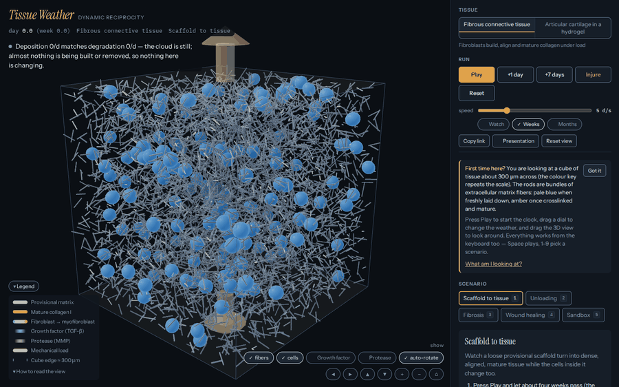
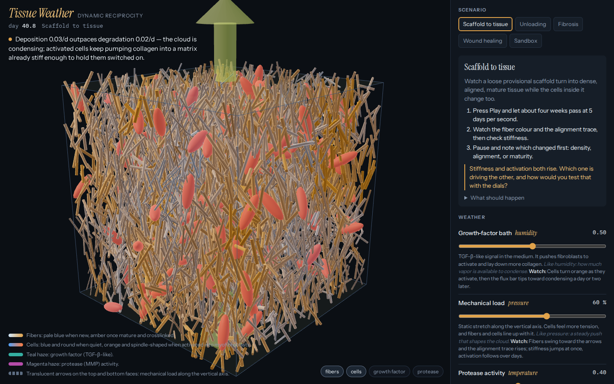
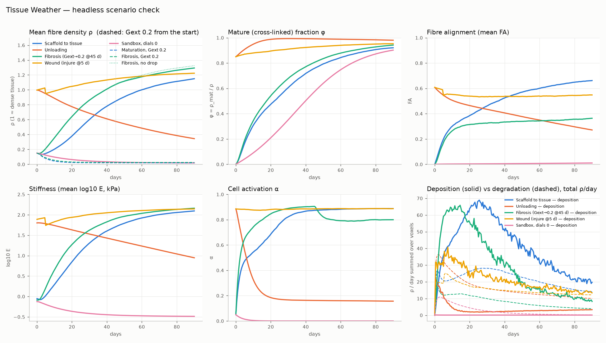

# Tissue Weather

**A browser-based 3D interactive for teaching *dynamic reciprocity* and tissue maturation in
tissue engineering.** A small cube of tissue — extracellular matrix plus a population of cells —
is simulated live. Students turn a handful of environmental "weather" dials and watch the matrix
condense, align, mature, scar or evaporate as the cells respond to the very matrix they are
building.

The teaching metaphor: a tissue is like a cloud. Fibers are the droplets, soluble precursors and
fragments are the vapour, and the dials push the deposition ⟷ degradation equilibrium one way or
the other. The interactive also shows where that metaphor breaks — turnover takes weeks, not
seconds; crosslinking is nearly irreversible, so the way down is not the way up; and cells are
not droplets, they rewrite their own rules.

Everything runs client-side. No install, no server, no account: one HTML file.




## Two tissues

v0.2 split the simulation into a **generic engine** (`src/engine.js`: voxel grid, matrix species,
diffusible fields, cell agents, fiber orientation tensor, numerics, stats, export) and **tissue
definitions** (`src/tissues/*.js`) that say what the matrix is made of, what the cells do, which
dials exist and which scenarios to teach. A tissue picker at the top of the panel switches
between them; the dials, scenario cards, readouts, legend and About text are all generated from
whichever definition is loaded.

| tissue | what it teaches | dials | scenarios |
|---|---|---|---|
| **Fibrous connective tissue** (`fibrous`) | fibroblasts build, align and mature collagen I under load; stiffness feeds back on activation, which is what makes fibrosis self-sustaining and unloading self-defeating | growth-factor bath, mechanical load, protease activity, cell number | Scaffold to tissue · Unloading · Fibrosis · Wound healing · Sandbox |
| **Articular cartilage in a hydrogel** (`cartilage`) | the deliberate anti-fibrous case: round, barely motile chondrocytes race a dissolving scaffold to build aggrecan and a collagen II network; stiffness comes from osmotic swelling held by collagen, not from fiber tension, and the cells can dedifferentiate into collagen I–making fibrocartilage | TGF-β3 bath, dynamic compression, oxygen tension, inflammation (IL-1), crosslink density, cell number, serum | Hydrogel to cartilage (the race) · Scaffold degrades too fast · Scaffold too dense · Fibrocartilage drift · Inflammatory breakdown |

The cartilage tissue is specified — every number with a DOI, every scenario with
machine-checkable targets — in
[`docs/tissues/cartilage-hydrogel.md`](docs/tissues/cartilage-hydrogel.md), and implemented in
`src/tissues/cartilage.js`. Both tissues run on the same engine, export the same trajectory
format and are held to the same conformance tests; adding a third is one definition file — the
scaffolder writes the registry line and the parameter document with it (see *Adding a tissue*
below).

## Quick start — instructors

**Get the page.** Any of these works; none needs Node, Python or a build step.

- **Download and open.** `dist/tissue-weather.html` is the whole app in one file. Double-click
  it. It fetches Three.js from jsdelivr the first time, so it needs internet on first load;
  after that the browser cache carries it.
- **No network in the room?** Take the offline copy: `dist/tissue-weather.offline.html` (about
  1.1 MB) has Three.js inlined and no import map, and makes **no network requests at all** — put it
  on a USB stick or the LMS and double-click it. It is not committed (it is a megabyte of vendored
  library), so a non-developer gets it from CI rather than from a build step: on GitHub, open
  **Actions → the latest CI run → Artifacts → `offline-page`**. The *vendored offline page* job
  rebuilds it on every push and no Node is needed to download it. That job is advisory on purpose —
  it fetches Three.js from a CDN — so on the rare run where the CDN was down the artifact is
  missing and you take the one from the run before it. The alternative, on a machine that does have
  a connection, is `node tools/build_single.mjs --vendor`. Use the offline page for teaching if the
  room's Wi-Fi is a lottery; use `tissue-weather.html` (smaller, cached library, system fonts
  loaded from Google) everywhere else.
- **GitHub Pages.** Settings → Pages → *Deploy from a branch* → your branch, folder `/ (root)`.
  The site then lives at `https://<user>.github.io/<repo>/` — for this repository,
  `https://jpeponis.github.io/tissuesimulations/`.
- **From source.** Serve the repository root over HTTP (ES modules do not load from `file://`)
  and open `index.html`: `npm run serve` → <http://localhost:8000/>.

**Link straight to the moment you want.** The URL carries the whole state and the app keeps it
current as you teach, so you can copy a link mid-demo (there is a **Copy link** button) and paste
it into the slide deck or the LMS:

```
index.html?tissue=fibrous&scenario=fibrosis
index.html?tissue=fibrous&scenario=maturation&Gext=0.9&strain=0.2&protease=0.2&nCells=240&speed=5
index.html?tissue=cartilage&scenario=toofast&speed=20
```

`tissue` and `scenario` take the keys from the table above; every dial of that tissue is accepted
by its own key; `speed` is simulated days per real second. Unknown or out-of-range values fall
back to the scenario's own settings, so a stale link never breaks the page.

**On a projector.**

- Full-screen the browser. Above 900 px wide the 3D view and the panel sit side by side; below
  that they stack, with the tissue on top — useful on a tall classroom screen.
- Speed: **5 d/s** for watching something happen, **20 d/s** for the eight-week stretches. The
  hint under the slider tells you what a week costs in real seconds.
- The **Table** button under the readouts prints the current values as text — readable from the
  back row, and it is also what a screen reader gets.
- Press **R** between runs: the previous run stays on the charts as dashed ghost traces, which is
  the whole point of the predict-then-run experiments. **Clear comparison** removes them.
- The scene auto-rotates slowly and stops on your first drag. A machine set to
  *prefers-reduced-motion* never auto-rotates.
- Dark room, dark page: the background is near-black by design, so the fibers and cells carry the
  contrast.

**Teach with it.** [`docs/TEACHING.md`](docs/TEACHING.md) has the learning objectives, a
50-minute outline, five guided experiments (predict → observe → explain), three misconceptions
the interactive is built to break, an assessment worksheet and the full reference list.

## Quick start — students

1. Open the page. You are looking at a cube of tissue about 300 µm on a side: rods are matrix
   fibers, the small bodies are cells (blue when quiet, orange when activated).
2. Pick a scenario from the row of cards. Read its **goal**, then its **question** — answer it
   out loud *before* you press Play.
3. Press **Play** (or Space). Watch the readouts in the panel: matrix density, alignment and
   activation, stiffness, and the flux gauge that shows deposition against degradation right now.
   The sentence in the top-left corner of the 3D view says, in words, which way the equilibrium is
   leaning and why.
4. Turn one dial at a time and wait a simulated week. Ask which readout moved *first*.
5. Press **R** to restart the scenario. The run you just did stays as dashed lines so you can
   compare.
6. Drag to orbit, scroll to zoom. The layer chips turn the growth-factor and protease clouds on.

## Controls

| key | action |
|---|---|
| `Space` | play / pause |
| `R` | reset the scenario — back to day 0 **with the preset's own dials**, so change a dial *after* Reset, not before (the previous run stays as dashed ghost traces) |
| `I` | injure — a spherical wound at a random spot (only for tissues that support it) |
| `P` | presentation mode: bigger live sentence and clock, hints hidden |
| `1` – `5` | load the *n*-th scenario (up to `9`; the fibrous tissue has five) |
| `←` `→` | nudge the focused dial (`Home` / `End` for its extremes); on a focused chart, walk the crosshair |
| `←` `→` `↑` `↓`, `+` `−`, `Home` | with the 3D view focused: orbit, zoom, and put the camera back on its default framing |
| `Tab` | move between controls; the 3D view is focusable and describes itself |

The single-character shortcuts (`R`, `I`, `P`, `1`–`9`) are **on** by default and have an off
switch: **About → Single-key shortcuts**, a chip that toggles them and remembers the choice in that
browser. Turn them off for dictation or any input that sends bare letters — with them off, `Space`
still plays and pauses, `Tab` still reaches every control, and the page stops advertising the keys
it is no longer listening for.

Buttons: **Play**, **+1 day**, **+7 days**, **Reset**, **Injure** (hidden for tissues without an
injury model), **Copy link**, **Presentation**, **Reset view**, **Table**, **Clear comparison**,
and — in the About panel — **Single-key shortcuts** and *Export trajectory (JSON for Blender)*.
Each scenario card also carries an **Auto-apply scripted events** chip: it is **off** by default,
so the events a scenario describes (the fibrosis bath drop on day 45, the wound on day 5) are yours
to perform with the dials unless you switch it on. Mouse: drag to orbit, wheel to zoom.

## What is in the box

| path | what |
|---|---|
| `index.html` | the app shell: layout, CSS, the Three.js import map, the teaching text |
| `src/engine.js` | the generic simulation engine — grid, matrix species, orientation tensor, fields, cells, numerics, stats, export. Knows nothing about any particular tissue |
| `src/tissues/` | the tissue definitions: `fibrous.js`, `cartilage.js`, the registry `index.js`, and `_template.js` (a commented starter that the test suite keeps working) |
| `src/render.js` | the Three.js scene: fiber rods, gel haze, scaffold lattice, cells, field clouds, load arrows |
| `src/plots.js` | the readouts: rolling time-series strips with ghost traces, and the flux gauge |
| `src/copy.js` | the copy every tissue shares: the live equilibrium sentence and the formatters |
| `src/recipe.js` | the one fiber-layout recipe the web renderer and the Blender importer both follow |
| `src/app.js` | the wiring: picker, dials, scenario cards, readouts, legend, About, keyboard, deep links, export |
| `dist/tissue-weather.html` | the single-file build (`npm run build`); `dist/tissue-weather.artifact.html` is the same page as a fragment |
| `docs/EXTENDING.md` | **the contract**: what a tissue definition looks like and what the engine, renderer, app, tools and tests promise |
| `docs/ARCHITECTURE.md` | the map: data flow, the single-file build, one line per file |
| `docs/SPEC.md` | the v0.1 design record (kept for provenance) |
| `docs/MODEL.md` | biology, equations, parameter table with sources, known simplifications |
| `docs/TEACHING.md` | learning objectives, 50-minute lesson, guided experiments, misconceptions, assessment |
| `docs/CHANGELOG.md` | what changed between versions, written for the instructor rather than the compiler |
| `docs/tissues/cartilage-hydrogel.md` | the literature specification behind the cartilage tissue, every number with a DOI |
| `tools/` | `build_single.mjs`, `check_dist.mjs`, `check_params_doc.mjs`, `new_tissue.mjs`, `run_headless.mjs`, `make_golden.mjs`, `plot_scenarios.py`, `screenshot_app.mjs`, `render_smoke.mjs`, `lib/browser.mjs` |
| `tests/` | `engine.test.mjs` (conformance for every tissue + the golden regressions), `build.test.mjs`, `tools.test.mjs`, `export.test.mjs` (the Blender reader on a fresh export), `fidelity.test.mjs` (the teaching claims, measured), `golden/` |
| `blender/` | `import_tissue.py` turns an exported trajectory into an animated Blender 4.2 scene; see [`blender/README.md`](blender/README.md) |
| `CONTRIBUTING.md` | dev setup, the build constraints and why they exist, the PR checklist |

## Running the tools

Node ≥ 20, and **no dependencies** — there is nothing to install.

| command | what it does |
|---|---|
| `npm test` | `node --test tests/*.test.mjs`: conformance for every registered tissue (schema, determinism, invariants, every scenario's checks, performance), the fibrous golden regression, the engine API, the build constraints and the tools |
| `npm run build` | writes `dist/tissue-weather.html` and `dist/tissue-weather.artifact.html`. It refuses to write a broken bundle: an unresolved local import, a surviving `import`/`export` statement or a duplicate top-level name is an error with a `src/file:line`, not a dead page |
| `node tools/build_single.mjs --vendor` | additionally writes `dist/tissue-weather.offline.html` — Three.js inlined, no network at all (needs the library once, from `dist/cdn-cache`, `node_modules` or curl) |
| `npm run check-dist` | rebuilds into a temp directory and fails if the committed `dist/` is stale |
| `npm run headless` | runs every scenario of a tissue in Node → `scratch/<tissue>/<run>.csv` (stats over time) and `<run>.json` (a format-2 trajectory). Flags after `--`, e.g. `npm run headless -- --tissue fibrous --days=40`; `--help` lists them and the runs, and an `--only` that is unknown — or empty — exits 2 instead of writing the wrong thing |
| `node tools/check_params_doc.mjs [--write]` | keeps every tissue's "as built" parameter block equal to its definition (`npm test` fails when they drift). The block lives in `docs/tissues/<key>.md` — `docs/MODEL.md` for the fibrous tissue — and is found by its `<!-- params:<key> -->` markers, so a new tissue needs no change to the tool |
| `npm run golden` | re-records the fibrous *engine* golden — the script is exactly `node tools/make_golden.mjs --tissue fibrous --out tests/golden/fibrous.engine.json`. Read `CONTRIBUTING.md` first: re-recording is legitimate only when a change was *meant* to move the numbers. For another tissue, write the command out with its own `--tissue` and `--out`. Aimed at `tests/golden/fibrous.json` the tool refuses (exit 2) and prints the right command: that file is the v0.1 reference and nothing here can re-record it |
| `npm run new-tissue -- <key> "<Name>"` | scaffolds and registers a new tissue definition, and writes its `docs/tissues/<key>.md` with the as-built parameter block already filled in |
| `npm run screenshot` | drives the real app in headless Chromium (needs Playwright), probes interaction and accessibility, and saves screenshots |
| `node tools/screenshot_app.mjs --width 720 --height 450 --dsf 2` | the **200 % browser-zoom check**: a 720×450 CSS viewport rendered at deviceScaleFactor 2, i.e. a 1440×900 window zoomed to 200 %. It is the only configuration that exercises the docked legend and the reflowed HUD, which is where the legend used to print itself over the clock. Add `--days 5 --out dist/shots/zoom200` to keep the frames |
| `npm run serve` | `python3 -m http.server 8000` from the repository root |
| `python3 tools/plot_scenarios.py --tissue fibrous` | matplotlib panels of the headless CSVs (`--dir scratch/fibrous` names the same directory; needs matplotlib; the columns it plots have to match the CSV header, which each tissue generates from its own species and fields) |

Headless scenario curves, from `npm run headless` and `tools/plot_scenarios.py`:



## Adding a tissue

Six steps here; the contract is [`docs/EXTENDING.md`](docs/EXTENDING.md), whose §8 walks through
the same work with the reasons attached.

1. **Scaffold it.** `npm run new-tissue -- mytissue "My tissue"` (the same thing as
   `node tools/new_tissue.mjs mytissue "My tissue"`) copies `src/tissues/_template.js` to
   `src/tissues/mytissue.js`, renames the identifiers, registers it in `src/tissues/index.js`, and
   writes `docs/tissues/mytissue.md` with the `<!-- params:mytissue -->` as-built block the test
   suite requires already filled in. Two keys are **reserved for the test fixtures** —
   `demotissue` and `demo-tissue` — so pick anything else.
2. **Describe the tissue.** Fill in `species` (what the matrix is made of: `fiber`, `gel` or
   `scaffold`), `fields` (what diffuses), `cellTypes`, `dials`, and at least two `scenarios` —
   each with `checks`, the machine-checkable version of the teaching claim.
3. **Write the rules.** `makeRules(engine, params)` returns `cell(ctx)` and `voxel(ctx)`: what a
   cell secretes and how it changes, and what happens to the matrix in a voxel. Start from the
   template's rules and change one thing at a time.
4. **Watch the curves.** `npm run headless -- --tissue mytissue`, then
   `python3 tools/plot_scenarios.py --tissue mytissue` (or `--dir scratch/mytissue`, the same
   directory spelled out). Tune until the scenario checks pass — the suite runs them automatically.
5. **Write its prose.** The scaffolder already put the generated as-built block into
   `docs/tissues/mytissue.md`; what it cannot write is the rest — what the tissue is, where its
   numbers come from, the range each one has to stay inside. Re-run
   `node tools/check_params_doc.mjs --write` after any parameter change: `npm test` fails while
   the block and the definition disagree, and the rewrite leaves your prose alone.
6. **Ship it.** `npm test`, `npm run build`, then open `index.html?tissue=mytissue`.

No *code* outside your file has to change, and nothing in `tools/` either: the renderer, the plots,
the panel, the export format, the Blender importer, the parameter checker and the tests are all
written against the contract rather than against a tissue.

## The model in one paragraph

Each voxel carries the densities of the tissue's matrix species, a shared fiber orientation
tensor (density, direction, anisotropy) and the local values of the diffusible fields. Cells are
agents with a position, a polarity and a few state scalars; they sense local stiffness, growth
factor and tension, and integrate them into an activation level. Activation sets how much
oriented matrix a cell deposits, how strongly it realigns fibers by traction, how fast it moves,
and how much protease and growth factor it releases. Deposited matrix stiffens the voxel, which
feeds back on activation — the loop that makes fibrosis self-sustaining and unloading
self-defeating. Mechanical load aligns fibers and cells along the load axis and raises sensed
tension. The engine owns the numerics; the equations and constants live in the tissue
definitions, which is why the two tissues can behave so differently on the same machinery.
Sources and the parameter table are in [`docs/MODEL.md`](docs/MODEL.md); the scenario
expectations are enforced in `tests/`.

## Browser support

Chrome/Edge 89+, Firefox 108+, Safari 16.4+ — the binding requirement is **import maps** (used to
load Three.js) plus WebGL 2. Any laptop GPU from the last decade runs the default settings
(12³ voxels, 160 cells) at 60 fps; there is no mobile-specific layout, but the page stacks and
remains usable on a tablet. If Three.js cannot be reached, the page says so and explains how to
put the two library files next to the HTML.

## Known limitations

- **The matrix is a summary, not a structure.** A voxel stores densities, an orientation tensor
  and field values; there are no individual fibrils, no basement membrane, no cell–cell junctions.
- **Numbers are illustrative.** Rates were chosen so a lesson fits in a class hour: adult collagen
  turns over in years, not weeks. Read the traces qualitatively; the *shapes* and the *orderings*
  are what the scenario checks pin down, not the absolute values.
- **Cells do not divide or die**, and one growth factor plus one protease dial stand in for whole
  signalling families. There are no immune cells, so an injury is a burst of signal, not
  inflammation with a cast of characters.
- **Load is static and uniaxial** along z, and there is no compaction of the construct.
- **Small domain, seeded randomness.** 12³ voxels ≈ 300 µm on a side; a different seed moves the
  cells and the wound site, though the population behaviour is stable.
- **The 3D scene needs a GPU and a CDN.** The first load fetches Three.js (build the offline copy
  above if that is a problem); a sandboxed viewer that blocks downloads also blocks
  *Export trajectory*.
- Each tissue's About panel says where the *cloud metaphor* breaks for that tissue; the modelling
  limitations are written up in `docs/MODEL.md` §5 (fibrous) and
  `docs/tissues/cartilage-hydrogel.md` §6 (cartilage).

## Blender

Run a scenario, then use **About → Export trajectory (JSON for Blender)** — or skip the browser
entirely with `npm run headless`, which writes the same format. Then:

```bash
npm run headless -- --tissue fibrous --only maturation --days 60   # writes scratch/fibrous/maturation.json
blender --background --python blender/import_tissue.py -- \
    --input scratch/fibrous/maturation.json --out render.png --all-frames
```

(`--blender PATH` on the headless run writes the same trajectory to `PATH` as well — that, and only
that, is what the older `maturation_traj.json` duplicate was for.)

[`blender/README.md`](blender/README.md) covers the GUI workflow, the trajectory formats, the
renderer switches, the synthetic sample trajectories (no browser or Node needed) and the limits.

## Scientific anchors

- Metzcar J, Duggan BS, Fischer B, Murphy M, Heiland R, Macklin P (2025). A simple framework for
  agent-based modeling with extracellular matrix. *Bull Math Biol* 87:43 — ECM elements with
  density, anisotropy and orientation, remodelled by cells.
- Zeigler AC, Richardson WJ, Holmes JW, Saucerman JJ (2016). *J Mol Cell Cardiol* 94:72–81 —
  fibroblast signalling network: TGF-β and mechanical input → collagen and MMP output.
- Hinz B (2015). *Matrix Biol* 47:54–65 — latent TGF-β stored in the matrix and activated by
  contractile cells on stiff substrate: the feedback that keeps fibrosis going.
- Loerakker S, Obbink-Huizer C, Baaijens FPT (2014). *Biomech Model Mechanobiol* 13:985–1001 —
  strain-driven collagen alignment in engineered tissue.
- Bissell MJ, Hall HG, Parry G (1982). *J Theor Biol* 99:31–68 — dynamic reciprocity.

Full citations with DOIs: [`docs/MODEL.md`](docs/MODEL.md) and
[`docs/TEACHING.md`](docs/TEACHING.md); the cartilage sources are in
[`docs/tissues/cartilage-hydrogel.md`](docs/tissues/cartilage-hydrogel.md).

## Citing

If you use Tissue Weather in a course or in a paper, cite it as software —
[`CITATION.cff`](CITATION.cff) has the machine-readable version (GitHub's *Cite this repository*
button reads it):

> Peponis, J. (2026). *Tissue Weather* (version 0.3.0) [software].
> https://github.com/jpeponis/tissuesimulations

## Contributing

[`CONTRIBUTING.md`](CONTRIBUTING.md): setup, the commands above, the three build constraints that
make the single-file page possible and why they are load-bearing, when regenerating the golden
regression is legitimate, and the PR checklist.

## Licence

**MIT** for the code. The **course text** — the documentation prose and the student-facing copy —
is also available under **CC BY 4.0**, so you can adapt it for your own class with attribution.
See [`LICENSE`](LICENSE).
