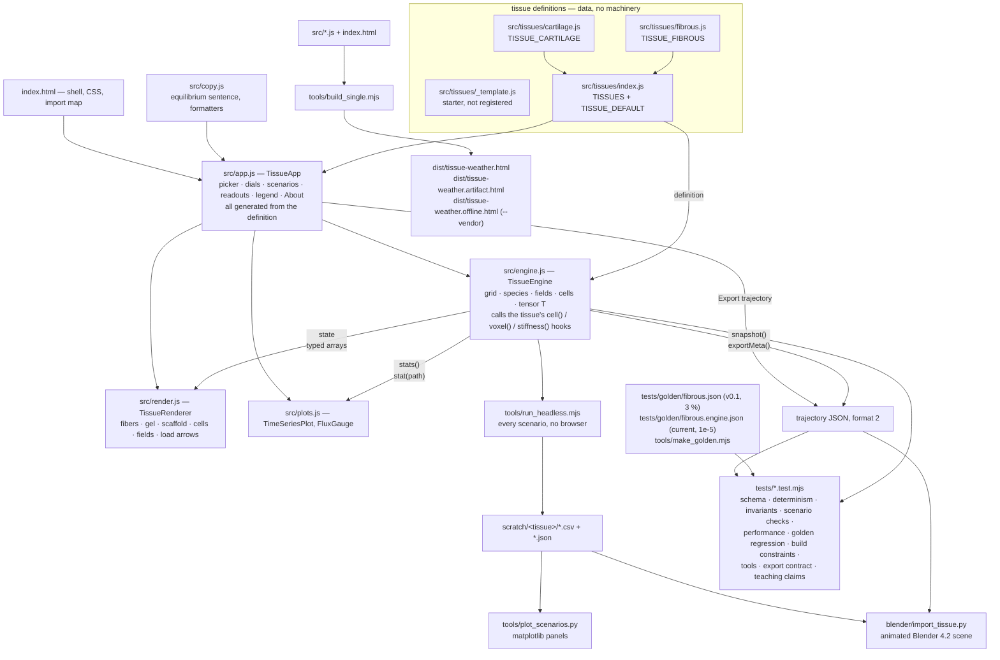

# Architecture

One page on how Tissue Weather is put together: what flows where, how the single-file build
works, and what every file is for. The **contract** between the engine and a tissue is
[`docs/EXTENDING.md`](EXTENDING.md) — this page is the map, that one is the law.

This page describes the tree as it stands: the contract is at **v0.4**, while `ENGINE_VERSION` and
`package.json` still say **0.3.0** until the release is cut ([`docs/CHANGELOG.md`](CHANGELOG.md)
says what changed between them, in plain language).

The shape of the system in one sentence: **a tissue definition is data; the engine, renderer,
plots, app, tools and tests are written against the contract and never against a specific
tissue.**

## 1. Data flow



Read it as five paths out of the same engine:

1. **The app.** `app.js` picks a tissue from the registry, constructs a `TissueEngine`, and
   generates the whole panel — tissue picker, dials, scenario cards, readouts, legend, About —
   from the definition. Each frame it steps the engine, hands `state` to the renderer and
   `stats()` to the plots. Nothing in `app.js`, `render.js` or `plots.js` names a tissue.
2. **Export → Blender.** `snapshot()` + `exportMeta()` produce the format-2 trajectory
   (EXTENDING.md §5) that `blender/import_tissue.py` turns into an animated scene.
3. **Headless.** `tools/run_headless.mjs` runs every scenario of a tissue in Node and writes
   one CSV of stats and one JSON trajectory per run; `tools/plot_scenarios.py` draws them.
4. **Tests.** `tests/engine.test.mjs` runs the conformance suite (EXTENDING.md §7) over every
   registered tissue *plus* the unregistered starter, so the template is always known to pass;
   `tests/build.test.mjs` enforces the build constraints and the fail-loud build; `tests/tools.test.mjs`
   covers the scaffolding, the dist check, the as-built parameter blocks and the shared harness;
   `tests/export.test.mjs` hands a fresh export to the real Blender reader; `tests/fidelity.test.mjs`
   measures the claims the teaching copy makes.
5. **The build.** `tools/build_single.mjs` inlines the sources into one HTML file.

### What crosses each boundary

| boundary | what crosses it | defined in |
|---|---|---|
| definition → engine | `species`, `fields`, `cellTypes`, `dials`, `scenarios`, `readouts`, `copy`, `injury`, `engine`, `params`, `makeRules()` | EXTENDING.md §1 |
| engine → rules | reusable `ctx` objects for `cell()`, `voxel()`, `stiffness()`; hooks write into `ctx.out.*` | §2 |
| engine → app/renderer | `state` (typed arrays), `stats()`, `stat(path)`, `snapshot()`, `exportMeta()` | §3 |
| renderer ← app | `setTissue(tissue)`, `update(state, layers)`, `legendSwatches()` | §4 |
| engine → Blender | trajectory JSON, `meta.format = 2` | §5 |
| definition → app | the picker, dial hints, scenario cards, legend and About are all generated | §6 |
| definition → tests | `scenarios[].checks` are machine-checkable expectations | §7 |

Determinism is a property of the whole chain: a seeded mulberry32 PRNG in the engine, no
`Math.random`, no DOM and no `performance` in `engine.js` or any tissue file, so the same
tissue + seed + dial sequence gives identical numbers in Node and in the browser. That is what
makes the golden regression and the scenario checks meaningful.

### What one step does, and why the order is part of the contract

The normative version of this is [`docs/EXTENDING.md`](EXTENDING.md) **§2.5 "Step order and input
staleness"**; read that before writing a rule. This is the reason it exists.

A `step()` is four passes over the same state: **cells** in index order (each one deposits into the
voxel it stands in, then moves), **binning and repulsion**, **voxels** in index order (each one
integrates its own `dRho`, rescales the orientation tensor, applies the load alignment and the
clamps, and stores its stiffness), then the **diffusive passes** — species transport, then the
fields. So a hook does not see one consistent snapshot of the world, and it cannot: the deposition
of the cell that ran a microsecond ago is already in `ctx.rho`, while `ctx.fa`, `ctx.fiberTotal` and
`ctx.E` are the values the LAST voxel pass computed, one step old. Which of the two a number is
decides what a rule means — a secretion law written against a live `rho` self-limits within the
step, and the same law written against the stale `fiberTotal` does not — so the staleness table in
§2.5 is a contract, not an implementation note, and `src/tissues/fibrous.js` reproduces the v0.1
model precisely because it reads the same stale `fiberTotal` v0.1 read.

Two consequences worth carrying around:

- **The RNG stream is part of the contract too.** §2.5 lists what draws from it and how often
  (reset: 1 + 3 draws per voxel; adding a cell: 6; a motile cell with `noise > 0`: 9 per step). A
  rule that stops writing `out.noise` does not just change that cell — it shifts every later random
  number in the run, so the goldens move. That is why "no behaviour change" work is checked against
  `tests/golden/fibrous.engine.json` at 1e-5 and not by eye.
- **A hook may only touch its own cell or voxel.** Anything that has to move between voxels is
  engine machinery — species transport (`D`, `sink`) or a field — because a hook that reads
  `engine.species[s][v ± 1]` silently couples the result to the visiting order of pass 4, and the
  next change to that order breaks it without a test noticing.

## 2. The single-file build

`tools/build_single.mjs` produces a page that runs from a double-click, from GitHub Pages, or
inside a host that only accepts a fragment:

```
src/copy.js  src/engine.js  src/tissues/<each>.js  src/tissues/index.js  src/plots.js  src/recipe.js  src/render.js  src/app.js
        │  strip `export `, drop local `import … from './…'`, hoist external imports
        ▼
   one <script type="module">  →  substituted for <script type="module" src="./src/app.js"> in index.html
        ├── dist/tissue-weather.html            full standalone page
        ├── dist/tissue-weather.artifact.html   head+body fragment for hosts that wrap the page
        └── dist/tissue-weather.offline.html    --vendor only: Three.js inlined, no import map, no network
```

Tissue files are discovered from `src/tissues/*.js` automatically (`index.js` last,
`_`-prefixed files skipped), so a new tissue needs no build change. Because the result is
**one module**, the three constraints of EXTENDING.md §0 are load-bearing:

- **named exports only** — the build strips `export ` from
  `const | let | var | function | class | async function` declarations and nothing else;
- **unique top-level identifiers across all of `src/`** — concatenation means one scope;
- **local imports on one line**, exactly `import { a, b } from './x.js';` — the build drops
  those lines whole, so a statement split over two lines leaves half of itself behind.

`tests/build.test.mjs` checks all three with regexes, plus the shape of the built page.
`tools/check_dist.mjs` rebuilds into a temp directory and diffs against `dist/`, so a source
change that never reached the committed artifact fails CI instead of shipping a stale page.

The build also refuses to write a page it knows is broken (docs/REVIEW.md D1). Because it
concatenates rather than resolves, an import it drops is only discovered when the page runs, so
`build_single.mjs` now **resolves every local specifier** against the bundle list and throws with
`src/file:line` when the target is not in it, throws on any `import` / `export` statement that
survived the strip, and finally `node --check`s the assembled module — which is what catches two
files declaring the same top-level `const`. A file that is not in the order is a build error, not a
silent omission: that is how `src/recipe.js` gets into the bundle above.

`--vendor` writes a third output, `dist/tissue-weather.offline.html`: the same page with
`three.module.min.js` and `OrbitControls.js` inlined as their own module scripts (their export
blocks rewritten to publish on `window`, the import map removed), sourced from `dist/cdn-cache`,
`node_modules` or curl. It needs no network at all — the classroom copy. The CDN variants stay,
because the artifact host's CSP blocks `blob:`/`data:` scripts and the vendored file is 1.1 MB.

Three.js is the only external dependency (besides the Google Fonts stylesheet): `index.html`
carries an import map pointing at `cdn.jsdelivr.net/npm/three@0.160.0`, and
`tests/build.test.mjs` fails if the version drifts apart between the page, the renderer harness and
the docs. `app.js` loads `render.js` with a *dynamic* import so a
CDN failure can be caught and explained; in the bundle `render.js` is already inlined ahead of
it, so the import is never attempted.

## 3. File map

### Application

| file | one line |
|---|---|
| `index.html` | app shell: CSS, the Three.js import map, the panel skeleton and the teaching text; carries the `<script type="module" src="./src/app.js">` marker the build replaces |
| `src/engine.js` | the generic engine: grid, matrix species, orientation tensor, diffusible fields, cell agents, numerics, stats, scenario checking, export; knows no tissue |
| `src/tissues/index.js` | the registry: `TISSUES` and `TISSUE_DEFAULT`; the only file that imports every tissue |
| `src/tissues/fibrous.js` | `TISSUE_FIBROUS` — fibroblasts, provisional matrix → mature collagen I; the v0.1 model expressed as engine rules |
| `src/tissues/cartilage.js` | `TISSUE_CARTILAGE` — chondrocytes in a degrading hydrogel (spec: `docs/tissues/cartilage-hydrogel.md`) |
| `src/tissues/_template.js` | heavily commented starter tissue; not registered, but the conformance suite runs it so the starter always passes |
| `src/render.js` | Three.js scene built from the definition: fiber rods, gel haze, scaffold lattice, cells, field point clouds, load arrows |
| `src/plots.js` | 2D canvas readouts: rolling time-series strips with ghost traces, and the deposition/degradation flux gauge |
| `src/copy.js` | the copy every tissue shares: the live equilibrium sentence and the dial/rate formatters |
| `src/recipe.js` | the one fiber-layout recipe (offsets, directions, lengths, radii) that `render.js` draws and `blender/import_tissue.py` re-implements |
| `src/app.js` | wiring: tissue picker, dials, scenario cards, readouts, legend, About, keyboard, deep links, export — all generated from the definition |

### Build outputs

| file | one line |
|---|---|
| `dist/tissue-weather.html` | the single-file build; what GitHub Pages and "just open the file" serve |
| `dist/tissue-weather.artifact.html` | the same page as a head+body fragment for hosts that supply their own document skeleton |
| `dist/tissue-weather.offline.html` | `--vendor` output: Three.js inlined, no import map, no network at all — the classroom copy. Git-ignored, so it is never committed; CI builds it on every push and uploads it as the `offline-page` artifact |
| `dist/shots/`, `dist/cdn-cache/` | screenshot output and the curl-fetched CDN cache used by the headless harnesses (both git-ignored) |

### Tools

| file | one line |
|---|---|
| `tools/build_single.mjs` | inlines `src/*.js` into the two `dist/*.html` outputs |
| `tools/check_dist.mjs` | rebuilds into a temp directory and fails if `dist/` is stale |
| `tools/check_params_doc.mjs` | rewrites (`--write`) and checks the `<!-- params:<tissue> -->` as-built blocks in the docs |
| `tools/lib/browser.mjs` | shared Playwright plumbing: find Playwright, serve a directory, launch Chromium, answer the CDNs from a cache, always clean up |
| `tools/new_tissue.mjs` | scaffolds `src/tissues/<key>.js` from the starter, registers it, and writes `docs/tissues/<key>.md` with the as-built parameter block already filled in |
| `tools/run_headless.mjs` | runs a tissue's scenarios (and per-tissue variants) in Node; writes CSV stats and format-2 trajectories |
| `tools/make_golden.mjs` | records the reference statistics of a tissue for the golden regression |
| `tools/plot_scenarios.py` | matplotlib panels of the headless CSVs |
| `tools/screenshot_app.mjs` | drives the real app in headless Chromium: interaction script, accessibility probes, screenshots, console errors |
| `tools/render_smoke.mjs`, `tools/render_smoke.html` | renderer-only harness: synthetic tissues, screenshots and frame-time measurements for `src/render.js` |

### Tests

| file | one line |
|---|---|
| `tests/engine.test.mjs` | conformance for every registered tissue (schema, determinism, invariants, scenario checks, performance), the fibrous golden regression, the engine API and the copy helpers |
| `tests/build.test.mjs` | the EXTENDING.md §0 source constraints and the shape of the built page |
| `tests/tools.test.mjs` | `new_tissue.mjs`, `check_dist.mjs`, `check_params_doc.mjs` and `lib/browser.mjs`, exercised in throw-away copies of the repo. Those copies carry the real `src/tissues/`, so the scaffolding fixtures use the reserved keys `demotissue` / `demo-tissue` — a real tissue of that name would break them |
| `tests/export.test.mjs` | the format-2 export per tissue, handed to `blender/import_tissue.py --dry-run` (skipped without python3) |
| `tests/fidelity.test.mjs` | the teaching claims of `docs/TEACHING.md` and the tissue copy, measured on the current engine |
| `tests/golden/fibrous.json` | reference statistics recorded from the v0.1 model (seed 7); matched within 3 % |
| `tests/golden/fibrous.engine.json` | the tight reference recorded from the current engine; matched at 1e-5 |

### Blender

| file | one line |
|---|---|
| `blender/import_tissue.py` | trajectory JSON → animated Blender 4.2 scene (fiber tubes, gel haze, scaffold struts, cells, load arrows) |
| `blender/make_sample_trajectory.py` | synthetic format-2 trajectories so the Blender side can be exercised without a browser or Node |
| `blender/sample_trajectory*.json` | the two committed fixtures. The fibrous one is a REAL engine export (reproducible byte-for-byte from `node tools/run_headless.mjs --tissue fibrous --only maturation --blender blender/sample_trajectory.json`); only the cartilage one is synthetic, from the script above |
| `blender/README.md` | trajectory formats, CLI and GUI workflows, renderer switches, limits |

### Documentation and repository files

| file | one line |
|---|---|
| `README.md` | what it is, how to run it, how to teach with it, how to add a tissue |
| `docs/EXTENDING.md` | **the contract**: tissue-definition shape, hooks, engine API, renderer, export format, app, conformance |
| `docs/ARCHITECTURE.md` | this page |
| `docs/SPEC.md` | the v0.1 design record (superseded by EXTENDING.md for structure) |
| `docs/MODEL.md` | biology, equations, parameter table with sources, known simplifications |
| `docs/TEACHING.md` | learning objectives, 50-minute lesson, guided experiments, misconceptions, assessment |
| `docs/CHANGELOG.md` | what changed between releases, written for the instructor who teaches with it |
| `docs/tissues/<key>.md` | one per tissue: the literature specification and the generated as-built parameter block (`cartilage-hydrogel.md` today; the fibrous block lives in `docs/MODEL.md`) |
| `docs/img/` | screenshots used by `README.md` |
| `CONTRIBUTING.md` | dev setup, commands, coding constraints, when regenerating the golden is legitimate, PR checklist |
| `package.json` | no dependencies; the npm scripts every command in the docs uses |
| `.github/workflows/ci.yml` | CI, four jobs: `node` (tests + build + dist freshness, deterministic and network-free), `offline` (advisory — the vendored offline page, uploaded as the `offline-page` artifact), `headless` (scenario run + matplotlib panel) and `screenshot` (advisory Playwright smoke, including the 200 % zoom pass) |
| `LICENSE`, `CITATION.cff` | MIT for the code, CC BY 4.0 for the course text; how to cite |

## 4. Where to make a change

| you want to | edit | then run |
|---|---|---|
| add a tissue | `node tools/new_tissue.mjs <key> "<Name>"` (it writes the definition, the registry line **and** `docs/tissues/<key>.md` with the `<!-- params:<key> -->` block), then `src/tissues/<key>.js` and the prose around that block | `npm run headless -- --tissue <key>`, `node tools/check_params_doc.mjs --write`, `npm test`, `npm run build` |
| change what cells or matrix do | that tissue's `params` and `makeRules()` | `npm test` (the scenario `checks` are the spec) |
| change the grid, numerics or a stat | `src/engine.js` — and `docs/EXTENDING.md`, because that is the contract | `npm test`; expect the golden to move only if you meant it |
| change the look of the 3D scene | `src/render.js` | `node tools/render_smoke.mjs --out <dir>` |
| change the panel, dials or deep links | `src/app.js`, `index.html` | `node tools/screenshot_app.mjs`, then `npm run build && npm run check-dist` |
| change the readouts | the tissue's `readouts` block first; `src/plots.js` only for a new chart *type* | `npm test`, screenshots |
| change the teaching text | the tissue's `copy` block, `src/copy.js`, `docs/TEACHING.md` | `npm test` (`tests/fidelity.test.mjs` measures the claims), then `npm run build` |
| change a tissue parameter | that tissue's `params` / `engine` block | `node tools/check_params_doc.mjs --write` (the docs carry a generated as-built block), then `npm test` |
| make an offline copy for a classroom | nothing | `node tools/build_single.mjs --vendor` → `dist/tissue-weather.offline.html` |
