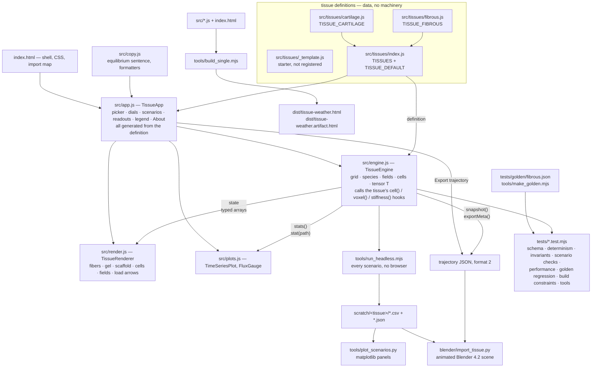

# Architecture (v0.3)

One page on how Tissue Weather is put together: what flows where, how the single-file build
works, and what every file is for. The **contract** between the engine and a tissue is
[`docs/EXTENDING.md`](EXTENDING.md) — this page is the map, that one is the law.

The shape of the system in one sentence: **a tissue definition is data; the engine, renderer,
plots, app, tools and tests are written against the contract and never against a specific
tissue.**

## 1. Data flow



Read it as five paths out of the same engine:

1. **The app.** `app.js` picks a tissue from the registry, constructs a `TissueEngine`, and
   generates the whole panel — tissue picker, dials, scenario cards, readouts, legend, About —
   from the definition. Each frame it steps the engine, hands `state` to the renderer and
   `stats()` to the plots. Nothing in `app.js`, `render.js` or `plots.js` names a tissue.
2. **Export → Blender.** `snapshot()` + `exportMeta()` produce the format-2 trajectory
   (EXTENDING.md §5) that `blender/import_tissue.py` turns into an animated scene.
3. **Headless.** `tools/run_headless.mjs` runs every scenario of a tissue in Node and writes
   one CSV of stats and one JSON trajectory per run; `tools/plot_scenarios.py` draws them.
4. **Tests.** `tests/engine.test.mjs` runs the conformance suite (EXTENDING.md §7) over every
   registered tissue *plus* the unregistered starter, so the template is always known to pass;
   `tests/build.test.mjs` enforces the build constraints; `tests/tools.test.mjs` covers the
   scaffolding and dist checks.
5. **The build.** `tools/build_single.mjs` inlines the sources into one HTML file.

### What crosses each boundary

| boundary | what crosses it | defined in |
|---|---|---|
| definition → engine | `species`, `fields`, `cellTypes`, `dials`, `scenarios`, `readouts`, `copy`, `injury`, `engine`, `params`, `makeRules()` | EXTENDING.md §1 |
| engine → rules | reusable `ctx` objects for `cell()`, `voxel()`, `stiffness()`; hooks write into `ctx.out.*` | §2 |
| engine → app/renderer | `state` (typed arrays), `stats()`, `stat(path)`, `snapshot()`, `exportMeta()` | §3 |
| renderer ← app | `setTissue(tissue)`, `update(state, layers)`, `legendSwatches()` | §4 |
| engine → Blender | trajectory JSON, `meta.format = 2` | §5 |
| definition → app | the picker, dial hints, scenario cards, legend and About are all generated | §6 |
| definition → tests | `scenarios[].checks` are machine-checkable expectations | §7 |

Determinism is a property of the whole chain: a seeded mulberry32 PRNG in the engine, no
`Math.random`, no DOM and no `performance` in `engine.js` or any tissue file, so the same
tissue + seed + dial sequence gives identical numbers in Node and in the browser. That is what
makes the golden regression and the scenario checks meaningful.

## 2. The single-file build

`tools/build_single.mjs` produces a page that runs from a double-click, from GitHub Pages, or
inside a host that only accepts a fragment:

```
src/copy.js  src/engine.js  src/tissues/<each>.js  src/tissues/index.js  src/plots.js  src/render.js  src/app.js
        │  strip `export `, drop local `import … from './…'`, hoist external imports
        ▼
   one <script type="module">  →  substituted for <script type="module" src="./src/app.js"> in index.html
        ├── dist/tissue-weather.html            full standalone page
        └── dist/tissue-weather.artifact.html   head+body fragment for hosts that wrap the page
```

Tissue files are discovered from `src/tissues/*.js` automatically (`index.js` last,
`_`-prefixed files skipped), so a new tissue needs no build change. Because the result is
**one module**, the three constraints of EXTENDING.md §0 are load-bearing:

- **named exports only** — the build strips `export ` from
  `const | let | var | function | class | async function` declarations and nothing else;
- **unique top-level identifiers across all of `src/`** — concatenation means one scope;
- **local imports on one line**, exactly `import { a, b } from './x.js';` — the build drops
  those lines whole, so a statement split over two lines leaves half of itself behind.

`tests/build.test.mjs` checks all three with regexes, plus the shape of the built page.
`tools/check_dist.mjs` rebuilds into a temp directory and diffs against `dist/`, so a source
change that never reached the committed artifact fails CI instead of shipping a stale page.

Three.js is the only external dependency: `index.html` carries an import map pointing at
`cdn.jsdelivr.net/npm/three@0.160.0`. `app.js` loads `render.js` with a *dynamic* import so a
CDN failure can be caught and explained; in the bundle `render.js` is already inlined ahead of
it, so the import is never attempted.

## 3. File map

### Application

| file | one line |
|---|---|
| `index.html` | app shell: CSS, the Three.js import map, the panel skeleton and the teaching text; carries the `<script type="module" src="./src/app.js">` marker the build replaces |
| `src/engine.js` | the generic engine: grid, matrix species, orientation tensor, diffusible fields, cell agents, numerics, stats, scenario checking, export; knows no tissue |
| `src/tissues/index.js` | the registry: `TISSUES` and `TISSUE_DEFAULT`; the only file that imports every tissue |
| `src/tissues/fibrous.js` | `TISSUE_FIBROUS` — fibroblasts, provisional matrix → mature collagen I; the v0.1 model expressed as engine rules |
| `src/tissues/cartilage.js` | `TISSUE_CARTILAGE` — chondrocytes in a degrading hydrogel (spec: `docs/tissues/cartilage-hydrogel.md`) |
| `src/tissues/_template.js` | heavily commented starter tissue; not registered, but the conformance suite runs it so the starter always passes |
| `src/render.js` | Three.js scene built from the definition: fiber rods, gel haze, scaffold lattice, cells, field point clouds, load arrows |
| `src/plots.js` | 2D canvas readouts: rolling time-series strips with ghost traces, and the deposition/degradation flux gauge |
| `src/copy.js` | the copy every tissue shares: the live equilibrium sentence and the dial/rate formatters |
| `src/app.js` | wiring: tissue picker, dials, scenario cards, readouts, legend, About, keyboard, deep links, export — all generated from the definition |

### Build outputs

| file | one line |
|---|---|
| `dist/tissue-weather.html` | the single-file build; what GitHub Pages and "just open the file" serve |
| `dist/tissue-weather.artifact.html` | the same page as a head+body fragment for hosts that supply their own document skeleton |
| `dist/shots/`, `dist/cdn-cache/` | screenshot output and the curl-fetched CDN cache used by the headless harnesses (both git-ignored) |

### Tools

| file | one line |
|---|---|
| `tools/build_single.mjs` | inlines `src/*.js` into the two `dist/*.html` outputs |
| `tools/check_dist.mjs` | rebuilds into a temp directory and fails if `dist/` is stale |
| `tools/new_tissue.mjs` | scaffolds `src/tissues/<key>.js` from the starter and registers it |
| `tools/run_headless.mjs` | runs a tissue's scenarios (and per-tissue variants) in Node; writes CSV stats and format-2 trajectories |
| `tools/make_golden.mjs` | records the reference statistics of a tissue for the golden regression |
| `tools/plot_scenarios.py` | matplotlib panels of the headless CSVs |
| `tools/screenshot_app.mjs` | drives the real app in headless Chromium: interaction script, accessibility probes, screenshots, console errors |
| `tools/render_smoke.mjs`, `tools/render_smoke.html` | renderer-only harness: synthetic tissues, screenshots and frame-time measurements for `src/render.js` |

### Tests

| file | one line |
|---|---|
| `tests/engine.test.mjs` | conformance for every registered tissue (schema, determinism, invariants, scenario checks, performance), the fibrous golden regression, the engine API and the copy helpers |
| `tests/build.test.mjs` | the EXTENDING.md §0 source constraints and the shape of the built page |
| `tests/tools.test.mjs` | `new_tissue.mjs` and `check_dist.mjs`, exercised in throw-away copies of the repo |
| `tests/golden/fibrous.json` | reference statistics recorded from the v0.1 model (seed 7); matched within 3 % |

### Blender

| file | one line |
|---|---|
| `blender/import_tissue.py` | trajectory JSON → animated Blender 4.2 scene (fiber tubes, gel haze, scaffold struts, cells, load arrows) |
| `blender/make_sample_trajectory.py` | synthetic format-2 trajectories so the Blender side can be exercised without a browser or Node |
| `blender/sample_trajectory*.json` | the generated samples (fibrous and cartilage) |
| `blender/README.md` | trajectory formats, CLI and GUI workflows, renderer switches, limits |

### Documentation and repository files

| file | one line |
|---|---|
| `README.md` | what it is, how to run it, how to teach with it, how to add a tissue |
| `docs/EXTENDING.md` | **the contract**: tissue-definition shape, hooks, engine API, renderer, export format, app, conformance |
| `docs/ARCHITECTURE.md` | this page |
| `docs/SPEC.md` | the v0.1 design record (superseded by EXTENDING.md for structure) |
| `docs/MODEL.md` | biology, equations, parameter table with sources, known simplifications |
| `docs/TEACHING.md` | learning objectives, 50-minute lesson, guided experiments, misconceptions, assessment |
| `docs/tissues/cartilage-hydrogel.md` | literature specification for the cartilage-in-hydrogel tissue, with DOIs |
| `docs/img/` | screenshots used by `README.md` |
| `CONTRIBUTING.md` | dev setup, commands, coding constraints, when regenerating the golden is legitimate, PR checklist |
| `package.json` | no dependencies; the npm scripts every command in the docs uses |
| `.github/workflows/ci.yml` | CI: tests + build + dist freshness, headless run + plots, optional Playwright smoke |
| `LICENSE`, `CITATION.cff` | MIT for the code, CC BY 4.0 for the course text; how to cite |

## 4. Where to make a change

| you want to | edit | then run |
|---|---|---|
| add a tissue | `node tools/new_tissue.mjs <key> "<Name>"`, then `src/tissues/<key>.js` | `npm test`, `npm run headless -- --tissue <key>`, `npm run build` |
| change what cells or matrix do | that tissue's `params` and `makeRules()` | `npm test` (the scenario `checks` are the spec) |
| change the grid, numerics or a stat | `src/engine.js` — and `docs/EXTENDING.md`, because that is the contract | `npm test`; expect the golden to move only if you meant it |
| change the look of the 3D scene | `src/render.js` | `node tools/render_smoke.mjs --out <dir>` |
| change the panel, dials or deep links | `src/app.js`, `index.html` | `node tools/screenshot_app.mjs`, then `npm run build && npm run check-dist` |
| change the readouts | the tissue's `readouts` block first; `src/plots.js` only for a new chart *type* | `npm test`, screenshots |
| change the teaching text | the tissue's `copy` block, `src/copy.js`, `docs/TEACHING.md` | `npm run build` |
